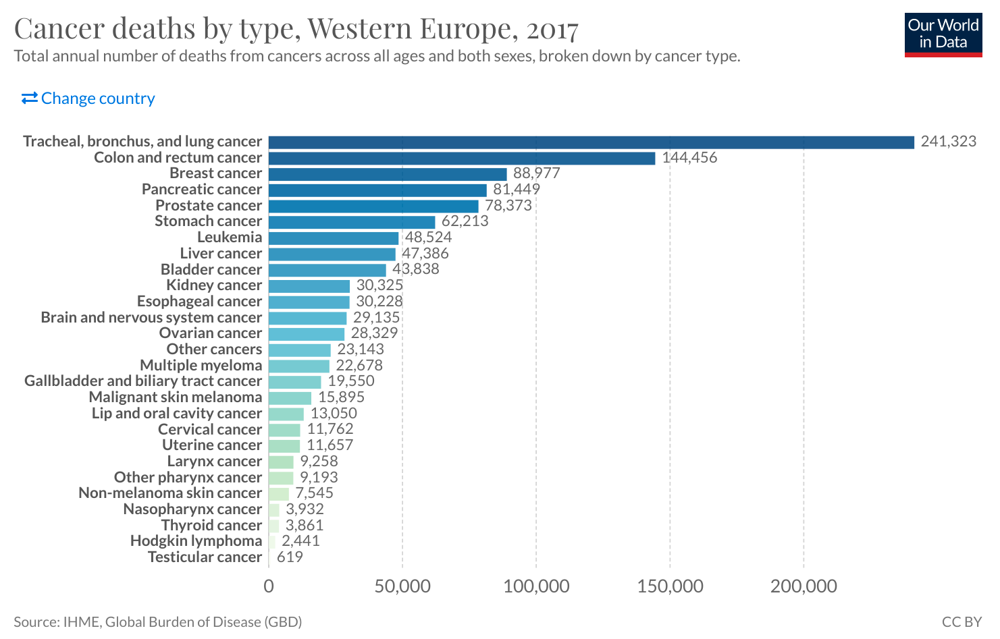

Survival Times for Different Cancers
========================================================
author: Daniel A.
date: March 2nd, 2021
font-import: https://fonts.googleapis.com/css?family=Ubuntu;
font-family: ubuntu, sans-serif;

Brief description of the dataset
========================================================
transition: fade
transition-speed: fast

We will use the Stat2Data package to obtain the data. The name of our dataset is "CancerSurvival". As described in the CRAN project pdf documenting the Stat2Data library:

The dataset consists of 64 observations on the following 2 variables:

- *Survival* : Survival time (in days)
- *Organ* : Breast, Bronchus, Colon, Ovary or Stomach

The **Survival** variable describes the post-disease survival time in days and the **Organ** variable describes the location of the malignancy.


```r
library(Stat2Data)
```

Original source:

- From the article "Supplemental Ascorbate in the Supportive Treatment of Cancer: Reevaluation ofProlongation of Survival Times in Terminal Human Cancer" by Ewan Cameron and Linus Pauling,Proceedings of the National Academy of Sciences of the United States of America, Vol. 75, No. 9(Sep., 1978), pp. 4538-4542.

More details on the package can be found [here]()

How does the dataset look like?
========================================================
transition: fade
transition-speed: fast

We can see the dataset is melted and we only have 2 columns.


Table: Genetic data

| Survival|Organ   |
|--------:|:-------|
|      124|Stomach |
|       42|Stomach |
|       25|Stomach |
|       45|Stomach |
|      412|Stomach |
|       51|Stomach |

Here we only see the first five entries, which are only for stomach cancers.

### Let's plot the mean survival time:


We can notice that the breast cancer mean survival time is the highest among all, followed by the time for ovary cancer. The lowest mean survival time is for Bronchus.

How many data points do we have per organ affected?
========================================================
transition: fade
transition-speed: fast

We can see that we do not have the same amount of data points per organ.


We can see that for ovary cancers we have a significantly smaller amount of entries, while for Bronchus and Colon cancers there's over 3x the observations that we have for Ovary cancers. Both being the malignancies with the largest amount of entries in the dataset.

Boxplots of survival time per cancer type
========================================================
transition: fade
transition-speed: fast


<style>
.p_iframe iframe {
  width: 100%;
  height: 1200px;
}
</style>

<div class="p_iframe"><iframe frameborder="0" seamless='seamless' scrolling=no src="plotly.html"></iframe></div>

In the boxplots we can see much of the same, where the seemingly least deadly cancer of our sample is breast, followed by ovary (for which we have almost no data though), followed by the rest.


Closing thoughts
========================================================
transition: fade
transition-speed: fast

Given the following:

$$\mu_{Bronchus} < \mu_{Stomach} < \mu_{Colon} < \mu_{Ovary} < \mu_{Breast}$$

We do not have enough statistical evidence to conclude that any of these cancers are less or more deadly than others. But supporting our argument on real evidence we can find out all of this.

In the following links we can find some interesting research on cancer mortality:

- [Cancer Research UK](https://www.cancerresearchuk.org/)

- [Our world in data: Cancer](https://ourworldindata.org/cancer)

From the latter we can present the following plot that shows more accurate and modern data:




